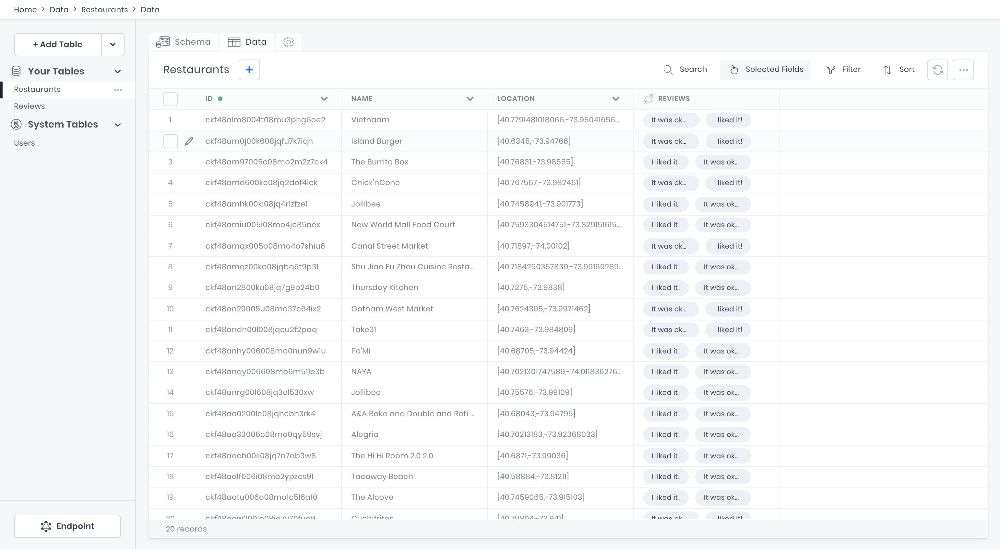
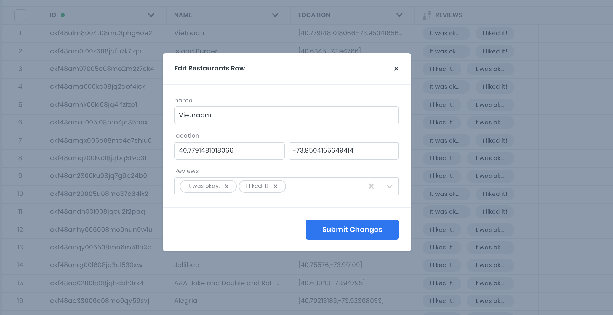
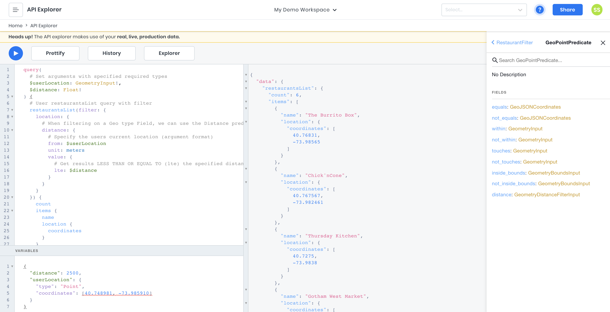
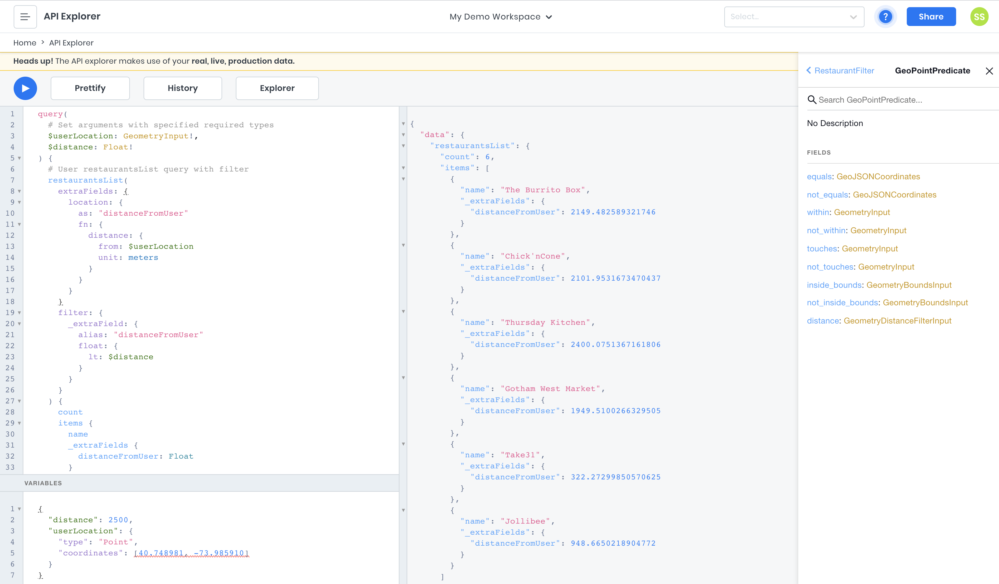

# Building Map Interface Apps using a Geo JSON GraphQL API

Developing apps that rely on geo-coordinates to enable important features must go far beyond simply storing latitude and longitude data. Geo coordinate algorithms that calculate bounds and distances can be a fun brain challenge to implement, though more often than not they become time-consuming distractions from one's core project.

In this tutorial, we’re going to look at how we can quickly set up and use an API that has advanced and ready to use Geo Coordinate operations. It doesn’t matter whether you are building a real estate application that’s map-based, a food reviews site that shows the distance a user is from the restaurant, or any other app that will need to work with geocoordinate data; this tutorial will apply to any such use case.

That said, we’re going to use the example of a food reviews app that needs to show user’s the distance they are from a reviewed restaurant. So let’s do it!

## Tutorial

To start, you’re going to need an 8base Workspace. The free plan will work just fine for this tutorial, so go ahead and sign up at app.8base.com if you haven’t already.

Once logged into 8base, we’re going to want to set up a simple data model for our reviews. It’s going to look like this:

**Restaurants**

- name: Text
- location: Geo
- Reviews: has_many Reviews

**Reviews**

- content: Text
- rating: Number
- Restaurant: has_one Restaurants

## Importing the Data Model and Seed Data

You’re welcome to quickly construct this data model using the 8base data builder. However, I'd recommend importing the schema and seed data using the CLI. It will not only quickly set up the data model but also populate the database with 20 restaurants and 40 reviews.

The following commands will quickly get you up and running! You'll want to feed the last `import` command a path to [this file](./schema-and-data.json).

```sh
# Install the cli
npm install -g 8base-cli
# Authenticate the CLI
8base login
# Create an empty 8base project and select workspace
8base init rr-tutorial -e
# Import the schema
8base import -f [PATH_TO schema-and-data.json]
```

At this point, the data model should be set up and the seed data ready to use! You can hop back into the 8base console and look at the Data Builder/Viewer to see the imported schema and records. It will look like the screenshot below.



## Reviewing the Saved Location Data

If you look at the _Restaurants_ table, you'll see there is a field called _location_ that has the type _Geo_ selected with the format set to _Point_. Geo Points are simply a latitude and longitude coordinate that together references a specific point on the map.

Now switch over to the `Data` tab and you'll see the _Location_ column displaying all the latitude and longitude coordinates in arrays. This is how the API received the data, though when editing a record via the UI 8base separates the two values.



With this GraphQL API being auto-generated by 8base, all our geo coordinate operations are ready to be used. So let's pop over to the API Explorer to see what kind of queries and mutations we have access to.

## Writing Queries with Geo Filtering

There are many methods to get a user's current location when they are using your app or website. For example, many modern browsers have implemented the Geolocation API that prompts the user for permission to access their current location. When granted, the following code snippet would return the user's location using geo coordinates.

```js
navigator.geolocation.getCurrentPosition(
  ({ coords: { latitude, longitude } }) => console.log([latitude, longitude])
)
```

Using the returned latitude and longitude, you'll be able to pass the user's location as an argument to your GraphQL query. We just happen to be working with a user's current location in this example. Any valid geo coordinates could be passed to a query for use in filtering, depending on the use case.

So, let's go ahead and write a query that allows us the filter by the distance a Restaurant is from the user's current location, using meters. We're going to manually set the user's current location to latitude 40.748981˚ longitude -73.985910˚, which is roughly the Empire State Building in New York City.

_Spoiler Alert: The restaurant data is all of the places in Manhattan!_

In the API Explorer, open up the _Variables_ input and paste in the following JSON blob. The top-level keys we'll be able to use as arguments in the query editor.

```json
{
  "distance": 2500,
  "userLocation": {
    "type": "Point",
    "coordinates": [40.748981, -73.98591]
  }
}
```

Now we'll write out our actual query. See it below and read the in code comments for context!

```graphql
query(
  # Set arguments with specified required types
  $userLocation: GeometryInput!
  $distance: Float!
) {
  # User restaurantsList query with filter
  restaurantsList(
    filter: {
      location: {
        # When filtering on a Geo type Field, we can use the Distance predicate.
        distance: {
          # Specify the users current location (argument format)
          from: $userLocation
          unit: meters
          value: {
            # Get results LESS THAN OR EQUAL TO (lte) the specified distance
            lte: $distance
          }
        }
      }
    }
  ) {
    count
    items {
      name
      location {
        coordinates
      }
    }
  }
}
```

Run the query and BOOM...we're in business! Well, not exactly.



We can see that from our given `userLocation`, 6 restaurants were within 2500 meters. However, we only filtered the list and in the response got back geo coordinates. What we need is to get back the actual distance calculation from our user!

## Using ExtraFields to Return Distance Calculations

We'll be able to accomplish this using an API feature called `extraFields`. Essentially, what we're going to do is return a calculated result that's **not** a part of our core data model. This is what `extraFields` enables us to do.

Let's re-work our query a bit to accomplish this requirement. Just like last time, see it below and read the in-code comments for context!

```graphql
query(
  # Set the same arguments with specified required types
  $userLocation: GeometryInput!
  $distance: Float!
) {
  # User restaurantsList query with filter and extraFields
  restaurantsList(
    extraFields: {
      # Specify which field the "extra field" will be calculated from
      location: {
        # Give the new field a unique name
        as: "distanceFromUser"
        fn: {
          # Declare the function calculate that will be used. In this case, distance from the userLocation using meters.
          distance: { from: $userLocation, unit: meters }
        }
      }
    }
    filter: {
      # Instead of repeating ourselves in the filter, we can filter using the extraField that's getting calculated!
      _extraField: {
        # Specify the extraField we're filtering by.
        alias: "distanceFromUser"
        # Declare the field type and relevant predicate. In this case, a float less than the specified distance.
        float: { lt: $distance }
      }
    }
  ) {
    count
    items {
      name
      # extraFields can then be collected in the response like so.
      _extraFields {
        distanceFromUser: Float
      }
    }
  }
}
```

Pretty cool! Right? As you can see in your response, you're now getting back the user's precise distance from the different restaurant locations in meters.



## Adding Grouping and Aggregation to the Query

As you can imagine, the `$distance` can be adjustable by your user in the UI. For example, they may select 1km, 5km, or 10km as the distance while using the app and then the query would run and filter accordingly. That said, other types of data can get generated in conjunction with the geocoordinate filters we just explored.

For example, what if the user not only wanted to see restaurants within 2500 meters but also wanted to see the average rating from reviews? How could that be accomplished?

We'll, by diving into the `groubBy` feature of the API we'd be able to accomplish this next level of complexity. Let's take a look!

```graphql
query(
  # Set arguments with specified required types
  $userLocation: GeometryInput!
  $distance: Float!
) {
  # User restaurantsList query with filter
  restaurantsList(
    extraFields: {
      # Specify which field the "extra field" will be calculated from
      location: {
        # Give the new field a unique name
        as: "distanceFromUser"
        fn: {
          # Declare the function calculate that will be used. In this case, distance from the userLocation using meters.
          distance: { from: $userLocation, unit: meters }
        }
      }
    }
    filter: {
      # Instead of repeating ourselves in the filter, we can filter using the extraField that's getting calculated!
      _extraField: {
        # Specify the extraField we're filtering by.
        alias: "distanceFromUser"
        # Declare the field type and relevant predicate. In this case, a float less than the specified distance.
        float: { lt: $distance }
      }
    }
  ) {
    count
    items {
      name
      _extraFields {
        distanceFromUser: Float
      }
      # In the response we specify a groupBy argument to the relation
      reviews(
        groupBy: {
          query: {
            # On the ratings field, we aggregate an average of the reviews belonging to a restaurant.
            rating: { as: "avgRating", fn: { aggregate: AVG } }
            # We alias the grouping as reviews
            _group: { as: "reviews" }
          }
        }
      ) {
        groups {
          # In each group, we return the avgRating as a float
          avgRating: Float
          # We return the "items" (reviews) with content and the individual rating
          reviews: ReviewGroup {
            items {
              content
              rating
            }
          }
        }
      }
    }
  }
}
```

An example of the expected response is below.

```json
{
  "data": {
    "restaurantsList": {
      "count": 6,
      "items": [
        {
          "name": "The Burrito Box",
          "_extraFields": {
            "distanceFromUser": 2149.482589321746
          },
          "reviews": {
            "groups": [
              {
                "avgRating": 4,
                "reviews": {
                  "items": [
                    {
                      "content": "I liked it!",
                      "rating": 4
                    },
                    {
                      "content": "It was okay.",
                      "rating": 4
                    }
                  ]
                }
              }
            ]
          }
        },
        {
          "name": "Chick'nCone",
          "_extraFields": {
            "distanceFromUser": 2101.9531673470437
          },
          "reviews": {
            "groups": [
              {
                "avgRating": 4.5,
                "reviews": {
                  "items": [
                    {
                      "content": "It was okay.",
                      "rating": 4.5
                    },
                    {
                      "content": "I liked it!",
                      "rating": 4.5
                    }
                  ]
                }
              }
            ]
          }
        }
        // ... more!
      ]
    }
  }
}
```

## Final Thoughts

As demonstrated, using an existing API platform we're able to quickly standup an extremely powerful API that has advanced geo coordinate operations built into it. This can apply to a large variety of applications that you maybe building.

I hope that you found this useful and interesting! Please let us know if you have any questions, as well as what projects you end up building using 8base!
